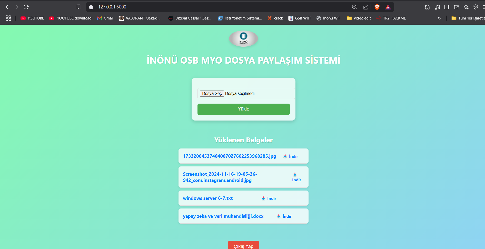

📁 Dosya Paylaşım Sistemi
Proje Hakkında
Dosya Paylaşım Sistemi (DPS), kullanıcıların dosyalarını güvenli bir şekilde yüklemelerini, bu dosyalara erişmelerini ve görüntülemelerini sağlayan bir Flask web uygulamasıdır. Kullanıcıların erişim yetkilendirmesi, öğrenci numarası doğrulaması yoluyla gerçekleştirilir. Uygulama ayrıca dosya listeleme ve dosya indirme gibi işlevleri barındırır. Güvenlik önlemleri ve kullanıcı dostu bir tasarıma odaklanılarak oluşturulmuştur.

✨ Özellikler

🛠️ Teknik Detaylar

🔧 İşlevlerin Ayrıntıları
Kullanıcı Doğrulama
Sisteme giriş yapmak isteyen kullanıcılar, öğrenci numaralarını girerek doğrulama sürecinden geçer. Numara şu özelliklere sahip olmalıdır:

Girilen öğrenci numarası MySQL veritabanındaki  tablosunda kontrol edilir. Eğer numara bu tabloda kayıtlı değilse kullanıcı giriş yapamaz.

Dosya Yükleme 📤

Kullanıcılar, dosya yükleme işlemine izin veren bir form aracılığıyla dosyalarını sisteme yükler. Yükleme sırasında:

Dosya Listeleme ve İndirme 📥

Ana sayfada, yüklenen tüm dosyalar listelenir. Kullanıcılar bu dosyalara erişim sağlayabilir ve gerektiğinde indirebilir. Sistem, her bir dosya için kullanıcıya güvenli bir erişim sağlar.

# 📸 Proje Ekran Görüntüleri 📸

Aşağıda projenin ekran görüntülerini bulabilirsiniz. Solda ve sağda yer alan görüntüler ekranın çalışma şeklini temsil ediyor.

| Giriş Ekranı 🏞️           | Dosya Paylaşım Ekranı 🏞️ |
|---------------------------|---------------------------|
|    |  |
