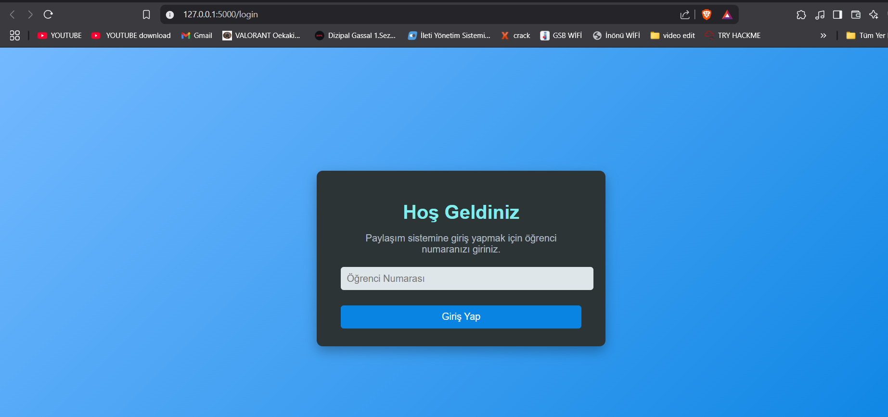

📁 Dosya Paylaşım Sistemi
Proje Hakkında
Dosya Paylaşım Sistemi (DPS), kullanıcıların dosyalarını güvenli bir şekilde yüklemelerini, bu dosyalara erişmelerini ve görüntülemelerini sağlayan bir Flask web uygulamasıdır. Kullanıcıların erişim yetkilendirmesi, öğrenci numarası doğrulaması yoluyla gerçekleştirilir. Uygulama ayrıca dosya listeleme ve dosya indirme gibi işlevleri barındırır. Güvenlik önlemleri ve kullanıcı dostu bir tasarıma odaklanılarak oluşturulmuştur.

✨ Özellikler


🛠️ Teknik Detaylar


🔧 İşlevlerin Ayrıntıları
Kullanıcı Doğrulama
Sisteme giriş yapmak isteyen kullanıcılar, öğrenci numaralarını girerek doğrulama sürecinden geçer. Numara şu özelliklere sahip olmalıdır:

Girilen öğrenci numarası MySQL veritabanındaki  tablosunda kontrol edilir. Eğer numara bu tabloda kayıtlı değilse kullanıcı giriş yapamaz.

Dosya Yükleme 📤

Kullanıcılar, dosya yükleme işlemine izin veren bir form aracılığıyla dosyalarını sisteme yükler. Yükleme sırasında:


Dosya Listeleme ve İndirme 📥

Ana sayfada, yüklenen tüm dosyalar listelenir. Kullanıcılar bu dosyalara erişim sağlayabilir ve gerektiğinde indirebilir. Sistem, her bir dosya için kullanıcıya güvenli bir erişim sağlar.

## 🔧 Teknik Detaylar
- **🌐 Framework**: Flask, Python tabanlı bir web geliştirme framework'ü olarak kullanılmıştır.
- **💾 Veritabanı**: MySQL, kullanıcı doğrulama ve veri saklama işlemlerini destekler.
- **🔑 Oturum Yönetimi**: Flask'in `session` özelliği, giriş yapmış kullanıcıların oturumlarını takip eder.
- **📂 Dosya İşlemleri**: Python'un `os` modülü, dosya ve klasörlerin yönetimi için kullanılmıştır.
- **📤 Dosya Yükleme**: Yüklenen dosyalar `uploads` adlı bir klasörde saklanır ve gerektiğinde sunulur.

---

## 🛠️ Gereksinimler
1. **🖥️ İşletim Sistemi**: Windows, macOS veya Linux
2. **🐍 Python Sürümü**: Python 3.x
3. **📦 Gerekli Kütüphaneler**:
   - Flask:
     ```bash
     pip install flask
     ```
   - MySQL Connector:
     ```bash
     pip install mysql-connector-python
     ```
4. **💽 Veritabanı Sunucusu**:
   - XAMPP ya da MySQL Server
5. **🌍 Tarayıcı**: Güncel bir tarayıcı (Google Chrome, Firefox, vb.)

# 📸 Proje Ekran Görüntüleri 📸

Aşağıda projenin ekran görüntülerini bulabilirsiniz. Solda ve sağda yer alan görüntüler ekranın çalışma şeklini temsil ediyor.

| Giriş Ekranı 🏞️           | Dosya Paylaşım Ekranı 🏞️ |
|---------------------------|---------------------------|
|    |  |
